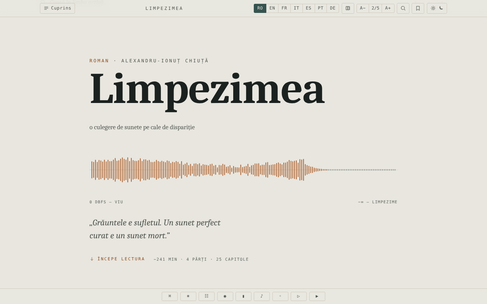

# Limpezimea

Roman SF de Alexandru-Ionuț Chiuță, ediție de lectură într-un singur fișier HTML, în șapte limbi (RO · EN · FR · IT · ES · PT · DE).

**Live:** https://chiuta.github.io/Limpezimea/

## Ce este

*Limpezimea* este un roman SF (descrierea din pagină: un tău din Retezat care mănâncă sunetul, ordinea și amintirea). Fișierul `index.html` conține textul complet în română și traduceri în engleză, franceză, italiană, spaniolă, portugheză și germană, plus un aparat critic (cronică, „Tăul Mut", studiu). Conform notei din colofon, aparatul critic a fost scris cu asistență AI (Claude). Aplicația indică 43.359 de cuvinte, aproximativ 241 de minute de lectură.

## Funcții

- Comutare între cele 7 limbi (butoane RO / EN / FR / IT / ES / PT / DE); opțiune pentru afișarea mai multor limbi în paralel (butonul „Număr de limbi").
- Cuprins pe părți și capitole, navigare cu săgeți, paletă de comenzi.
- Teme: întunecată, luminoasă, sepia, „tău"; mărimea textului pe 5 trepte (A− / A+).
- Căutare în text, concordanță, glosar de „intraductibile", minimap, mod focus.
- Semne de carte și note personale (cu export al marginaliilor).
- Citat decupabil, textură de „grăunte" peste text, peisaj sonor generativ (Web Audio), derulare automată, „Ascultă" (sinteză vocală a browserului).
- Poartă anti-spoiler înaintea aparatului critic („gate"), cu deblocare memorată.
- Atașare la accesibilitate: link „Sari la text", regiune ARIA live, respectarea preferinței pentru mișcare redusă.

## Manual de utilizare

1. Deschideți pagina; alegeți limba din butoanele RO … DE (tastele `1`–`7` aleg limba; `Shift` sau `Ctrl`/`Cmd` + clic, sau apăsare lungă, comută afișarea paralelă).
2. Deschideți „Cuprins" pentru a sări la un capitol. `←` / `→` sau `k` / `j` trec la capitolul anterior/următor; `Home`, `End`, `PageUp`, `PageDown` derulează.
3. `/` deschide căutarea; `Ctrl+K` / `Cmd+K` deschide paleta de comenzi; `Esc` închide panourile.
4. `B` adaugă/scoate un semn de carte la poziția curentă; `N` adaugă o notă; `F` pornește modul focus; `P` schimbă numărul de limbi afișate.
5. Butonul de temă ciclează temele; A− / A+ schimbă mărimea textului (clic pe „2/5" o resetează).
6. Butoanele din bara de jos: Comenzi, Intraductibile (glosar), Concordanță, Mod focus, Minimap, Câmp sonor, Grăunte, Redare (derulare automată), Ascultă.
7. Poziția de citire, semnele și notele se păstrează automat în browser.

## Confidențialitate și rețea

- Aplicația nu face apeluri de rețea (fără `fetch`, CDN-uri sau resurse externe); colofonul afirmă „fără urmărire, fără conturi". Singura legătură externă este linkul către textul licenței CC0.
- **Stocare locală (`localStorage`, chei cu prefixul `limp.`):** limba, tema, mărimea textului, poziția de citire, semne de carte, note, preferințe (focus, minimap, grăunte, volum sunet, viteză derulare), starea de deblocare a aparatului critic.
- „Ascultă" folosește sinteza vocală a browserului/sistemului; comportamentul depinde de acestea.

## Rulare locală / offline

Descărcați `index.html` (circa 2,6 MB) și deschideți-l în browser; nu necesită internet.

## Licență

CC0 1.0 Universal (domeniu public) — vezi fișierul LICENSE

## Autor

Alexio — Alexandru-Ionuț Chiuță. Contact: alexio@trom.tf

## English summary

Limpezimea ("Limpidity") is a science-fiction novel by Alexandru-Ionuț Chiuță, packaged as a single offline HTML reading edition in seven languages (RO, EN, FR, IT, ES, PT, DE) with a critical apparatus partly written with AI assistance (Claude). Features: parallel languages, themes, search, bookmarks and notes, soundscape, focus mode. No network requests; preferences stored in localStorage (`limp.*`). CC0 1.0.
